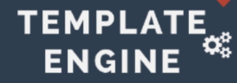

    
     

<h1 align="center">
    Awesome Template Engine
</h1>

---
The repository contains the list of all available template engines in different programming languages. It covers 100+ open source template engine along with their repository.

# Table of Contents
- List of template engines 
- Programming Languages
- Benchmarks

## List of template engines

---

| Programming Language          | # Template Engines | Template engines name                                                                                                                                                                |
|-------------------------------|--------------------|--------------------------------------------------------------------------------------------------------------------------------------------------------------------------------------|
| [C#](#c%23)                   | 8                  | DotLiquid, Fluid, Handlebars.Net, MJML.Net, RazorLight, Scriban, Spark, Stubble                                                                                                      |
| [C++](#c++)                   | 4                  | Inja, Jinja2Cpp, mstch, Qentem                                                                                                                                                       |
| [CoffeeScript](#Coffeescript) | 1                  | DocPad                                                                                                                                                                               |
| [Go](#go)                     | 12                 | Ace, Amber, Ego, GoRazor, Hero, Jade, Jet, Mustache.go, Pongo2, QuickTemplate, Raymond, Soy                                                                                          |
| [Groovy](#groovy)             | 1                  | Jenkins Templating Engine(JTE)                                                                                                                                                       |
| [Java](#java)                 | 17                 | Blade, Closure-Templates, FreeMarker, Handlebars.java, HtmlFlow, JinJava, JMustache, JStachio, JTE, ManTL, Mustache.java, Pebble, Pug4J(Jade4J), Rocker, Thymeleaf, Trimou, Velocity |
| [JavaScript](#javascript)     | 19                 | .Dom, Art-template, Carbone, Consolidate.js, doT, DustJS, ECT, EJS, Handlebars.js, Hogan.js, Lodash, Marko, MJML, Nunjucks, Mustache.js, Pug, Rivets, Swig, Twig.js, Velocity.js     |
| [Kotlin](#kotlin)             | 1                  | Barber                                                                                                                                                                               |
| [Lua](#lua)                   | 2                  | Lua Resty Template, Lustache                                                                                                                                                         |
| [PHP](#php)                   | 15                 | Blade, Blade One, Dwoo, Fenom, Laravel Blade, Latte, Mustache.php, PHP Text Template, Plates, RainTPL 3, Savant, Smarty, TinyButStrong, Twig, Volt                                   |
| [Python](#python)             | 10                 | Chameleon, Cheetah3, Chevron, Genshi, Jinja, Jsonnet, Kajiki, Mako, Pystache, Unprompted                                                                                             |
| [R](#r)                       | 1                  | Whisker                                                                                                                                                                              |
| [Ruby](#ruby)                 | 7                  | ERB, Haml, Hamlit, Jb, JBuilder, Mustache, Liquid                                                                                                                                    |
| [Rust](#rust)                 | 6                  | Handlebars-rust, Maud, Liquid-rust, Rust-Mustache, SailFish, Tera                                                                                                                    |
| [Scala](#scala)               | 7                  | Beard, Handlebars.scala, Hepek,  ScalaTags, Scalate, Thera, Twirl                                                                                                                    |
| [Swift](#swift)               | 2                  | GRMustache.swift, Stencil                                                                                                                                                            |
| [TypeScript](#typescript)     | 3                  | Eta, LiquidJS, Squirrelly                                                                                                                                                            |

## Programming Languages

---
### C#

Click to expand

1. [DotLiquid](https://github.com/dotliquid/dotliquid) : DotLiquid is a .Net port of the popular [Liquid](https://github.com/Shopify/liquid) templating language written in Ruby.
2. [Fluid](https://github.com/sebastienros/fluid) : Fluid is an open-source .NET template engine based on the [Liquid](https://github.com/Shopify/liquid) template language.
3. [Handlebars.Net](https://github.com/Handlebars-Net/Handlebars.Net) : Handlebars.Net is inspired from [Handlebars.js](http://handlebarsjs.com/) and compiles Handlebars templates directly to IL bytecode. It mimics the JS library's API as closely as possible.
4. [MJML.Net](https://github.com/SebastianStehle/mjml-net) : MJML.Net is a fast port of [MJML 4](https://mjml.io/) to .NET 6 & 7.
5. [RazorLight](https://github.com/toddams/RazorLight) : RazorLight is used for building templates from Files outside of ASP.NET MVC.
6. [Scriban](https://github.com/scriban/scriban) : Scriban is a fast, and lightweight scripting language and engine for .NET primarily developed for text templating with a compatibility mode for parsing [liquid](https://shopify.github.io/liquid/) templates.
7. [Spark](https://github.com/SparkViewEngine/spark) : Spark is a view engine for ASP.NET MVC, FubuMVC, NancyFx and Castle Project MonoRail frameworks and allows html to dominate the flow and get fit. Inspired syntax from Jade/Haml template engines.
8. [Stubble](https://github.com/StubbleOrg/Stubble) : Stubble is an implementation of the [Mustache](https://mustache.github.io/) template system in C#.

### C++

Click to expand

1. [Inja](https://github.com/pantor/inja) : Inja is a template engine for modern C++, inspired by [Jinja](https://jinja.palletsprojects.com/en/3.1.x/) for python.
2. [Jinja2Cpp](https://github.com/jinja2cpp/Jinja2Cpp): C++ implementation of the [Jinja2](https://jinja.palletsprojects.com/en/2.10.x/) Python template engine.
3. [mstch](https://github.com/no1msd/mstch) : mstch is a complete implementation of [mustache](http://mustache.github.io/) template engine in C++ and complies with specifications v1.1.3, including the lambda module.
4. [Qentem](https://github.com/HaniAmmar/Qentem-Engine) : Qentem is a self-contained lightweight library for rendering templates and works in both back-end(included in C++/C/Java projects) or the font-end(WASM).

### CoffeeScript

Click to expand

1. [Docpad](https://github.com/docpad/docpad) : DocPad is for streamlining the web development process and creating powerful websites and applications. [Syntax usage](https://docpad.bevry.me/start/begin)

### Go

Click to expand

1. [Ace](https://github.com/yosssi/ace) : Ace is an HTML template engine inspired by Slim and Jade.
2. [Amber](https://github.com/eknkc/amber) : Amber is an elegant templating engine for Go Programming Language It is inspired from HAML and Jade.
3. [Ego](https://github.com/benbjohnson/ego) : Ego is an [ERB](https://docs.ruby-lang.org/en/2.3.0/ERB.html) style templating language for Go. It transpiles templates into pure Go and including them at compile time.
4. [GoRazor](https://github.com/sipin/gorazor) : GoRazor is the golang port of the [Razor](https://asp-blogs.azurewebsites.net/scottgu/introducing-razor) view engine originated from ASP.NET.
5. [Hero](https://github.com/shiyanhui/hero) : Hero is a fast and powerful go template engine, which pre-compiles the html templates to go code.
6. [Jade](https://github.com/Joker/jade) : Jade.go is a simple and fast template engine implementing [Jade/Pug](https://pugjs.org/language/tags.html) template in Go.
7. [Jet](https://github.com/CloudyKit/jet) : Jet is a template engine developed to be powerful, dynamic and fast.[Syntax Doc](https://github.com/CloudyKit/jet/blob/master/docs/syntax.md)
8. [Mustache.go](https://github.com/hoisie/mustache) : mustache.go is a go implementation of the [mustache](https://github.com/mustache/spec) spec template engine and suited for website templates.
9. [Pongo2](https://github.com/flosch/pongo2) : Pongo2 is a Django-syntax like templating-language. [Documentation](https://pkg.go.dev/github.com/flosch/pongo2)
10. [QuickTemplate](https://github.com/valyala/quicktemplate) : A fast and powerful template engine for Go inspired from [Mako templates](https://www.makotemplates.org/).
11. [Raymond](https://github.com/aymerick/raymond) : Raymond, is the go port for Handlebars implemented by [Handlebars.js](https://github.com/handlebars-lang/handlebars.js) 3.0. [Documentation](https://pkg.go.dev/github.com/aymerick/raymond)
12. [Soy](https://github.com/robfig/soy) : Go implementation for Soy templates aka [Google Closure Templates](https://github.com/google/closure-templates). [Documentation](https://pkg.go.dev/github.com/robfig/soy)

### Groovy

Click to expand

1. [Jenkins Templating Engine](https://github.com/jenkinsci/templating-engine-plugin) : Jenkins Templating Engine (JTE) is a plugin enabling Jenkins pipeline templating and governance. JTE brings the Template Method Design Pattern to pipelines and remove the Jenkinsfile from individual source code repositories in favor of a centralized, tool-agnostic Pipeline Template.

### Java

Click to expand

1. [Apache FreeMarker](https://github.com/apache/freemarker) : FreeMarker is a Java template engine that can be used to generate text output (anything from HTML to auto generated source code) based on templates.
2. [Apache Velocity](https://github.com/apache/velocity-engine) : Velocity is Java based template engine with [documentation](https://velocity.apache.org/engine/1.7/user-guide.html)
3. [Blade](https://github.com/lets-blade/blade) : Blade is a simple open source web framework that helps you quickly build a web application. Blade pursuit is to simplify JavaWeb development. [Documentation](https://lets-blade.github.io/docs/en/blade-design.html)
4. [Closure-Templates](https://github.com/google/closure-templates) : Closure Templates are a client and server-side templating system that helps to dynamically build reusable HTML and UI elements from Google.
5. [Handlebars.java](https://github.com/jknack/handlebars.java) : Handlebars.java is a Java port of the Handlebars template engine and follows Mustache template. Documentation is [here](https://jknack.github.io/handlebars.java/).
6. [HtmlFlow](https://github.com/xmlet/HtmlFlow) : HtmlFlow is a Java DSL to write typesafe HTML in a fluent style.
7. [JinJava](https://github.com/HubSpot/jinjava) : Java-based template engine based on django template syntax, adapted to render jinja templates and developed by HubSpot Inc.
8. [JMustache](https://github.com/samskivert/jmustache) : A Java implementation of Mustache specification template engine.
9. [JStachio](https://github.com/jstachio/jstachio) : A Mustache compatible type-safe Java templating engine. [Documentation](https://jstach.io/doc/jstachio/current/apidocs/)
10. [JTE](https://github.com/casid/jte) : JTE(Java Template Engine) is lightweight template engine for Java and Kotlin. It gives same productive and typesafe experience as writing Java/Kotlin code.
11. [ManTL](https://github.com/manifold-systems/manifold/tree/master/manifold-deps-parent/manifold-templates) : Manifold template Language(ManTL) is a lightweight & type-safe template engine integrated with the Java compiler using Manifold. These templates when compiled in the build can be directly used similar to Java classes.
12. [Mustache.java](https://github.com/spullara/mustache.java) : Mustache.java is a derivative template engine of [mustache.js](http://mustache.github.io/mustache.5.html). It has its own parser written in Java.
13. [Pebble](https://github.com/PebbleTemplates/pebble) : Pebble is inspired from Twig template engine, and it's syntax is similar to Jinja template engine. [Documentation](https://pebbletemplates.io/). It features template inheritance feature and easy-to-read syntax. It has a topdown parser.
14. [Pug4J](https://github.com/neuland/pug4j) : Pug4J(earlier named [Jade4J](https://github.com/neuland/jade4j)) is built for Pug templates to be run in Java. It is Java implementation of the [original JavaScript](https://pugjs.org/api/getting-started.html) work.
15. [Rocker](https://github.com/fizzed/rocker) : Rocker uses an intuitive, tagless syntax with standard Java expressions for iteration, control, and values. Rocker's parser considers everything literal text except when it starts with the @ character.
16. [ThymeLeaf](https://github.com/thymeleaf/thymeleaf) : Thymeleaf is a server-side Java template engine for both web and standalone environments. [Documentation](https://www.thymeleaf.org/documentation.html)
17. [Trimou](https://github.com/trimou/trimou) : Trimou(Trim Your Mustache Templates) is a Mustache spec implemented template engine. The helpers are inspired from [Handlebars.js](http://handlebarsjs.com/). [Self defined parser](https://github.com/trimou/trimou/blob/master/core/src/main/java/org/trimou/engine/parser/DefaultParser.java)

### JavaScript

Click to expand

1. [.Dom](https://github.com/wavesoft/dot-dom) : .dom tries to replicate re-usable component and virtual DOM with the smallest possible footprint(within 512 bytes), exploiting the ES6 javascript features. It is to built powerful GUIs in tight space environments, such as IoT devices.
2. [Art template](https://github.com/aui/art-template) : Art-template is a fast templating engine that optimizes template rendering speed by scope pre-declared technique and achieving similar to Javascript speed. [Documentation](https://aui.github.io/art-template/docs/)
3. [Carbone](https://github.com/carboneio/carbone) : Carbone is a mustache-like template engine and is a open source document generator. [Documentation](https://carbone.io/documentation.html)
4. [Consolidate.js](https://github.com/tj/consolidate.js) : This library consolidates most of the known template engines implemented in JS in a single npm package.
5. [doT](https://github.com/olado/doT) : doT was created to be fastest JavaScript templating function with emphasis on performance under V8 and nodejs.
6. [DustJS](https://github.com/linkedin/dustjs) : LinkedIn developed an asynchronous Javascript templating. Dust templates are compiled to JavaScript for speed of execution. [old Documentation](https://github.com/linkedin/dustjs/wiki/Dust-Tutorial)
7. [ECT](https://github.com/baryshev/ect) : Performance focused JavaScript template engine with embedded CoffeeScript syntax.
8. [EJS](https://github.com/mde/ejs) : Embedded JavaScript(EJS) templates are designed to be flexible and easy-to-write, but without much abstractions. [Online Playground](https://ionicabizau.github.io/ejs-playground/) and [Syntax Documentation](https://github.com/mde/ejs/blob/main/docs/syntax.md)
9. [Handlebars](https://github.com/handlebars-lang/handlebars.js) : Handlebars.js is template engine, superset of Mustache template and parser generated using [Jison](https://gerhobbelt.github.io/jison/docs/. [Documentation](https://handlebarsjs.com/guide/)
10. [Hogan.js](https://github.com/twitter/hogan.js) : Hogan.js is a compiler for the Mustache templating language. It has separate scanning, parsing and code generation phases which can be useful for pre-processing templates on the server. [Documentation](http://twitter.github.io/hogan.js/)
11. [Lodash](https://github.com/lodash/lodash) : Lodash is a utility library for working with arrays, numbers, objects, strings, creating composite functions, etc. [Documentation](https://lodash.com/)
12. [Marko](https://github.com/marko-js/marko) : Marko is HTML reimagined as a language for building dynamic and reactive user interfaces. [Syntax Documentation](https://markojs.com/docs/syntax/)
13. [MJML](https://github.com/mjmlio/mjml) : MJML is a markup language created by Mailjet and designed to reduce the pain of coding a responsive email.
14. [Mozilla Nunjucks](https://github.com/mozilla/nunjucks) : Nunjucks is a templating engine, heavily inspired from Jinja2 with template inheritance & asynchronous control in javascript. [Documentation](https://mozilla.github.io/nunjucks/templating.html)
15. [Mustache.js](https://github.com/janl/mustache.js) : Mustache.js is a JavaScript implementation of the mustache templates(logic -less templates).
16. [Pug](https://github.com/pugjs/pug) : Pug is a high-performance template engine influenced by [Haml](https://haml.info/) and implemented with JavaScript for Node.js and browsers. [Documentation](https://pugjs.org/api/getting-started.html)
17. [Rivets](https://github.com/mikeric/rivets) : Rivets is a lightweight data binding and template engine that specializes in building data-driven views. [Documentation](http://rivetsjs.com/docs/guide/)
18. [swig](https://github.com/paularmstrong/swig/) : Swig is a simple, Django/Jinja-like template engine for node.js. The original repo is not-maintainable mode now.
19. [Twig.js](https://github.com/twigjs/twig.js) : Twig.js is a pure JavaScript implementation of the Twig PHP templating language. [Documentation](https://github.com/twigjs/twig.js/wiki/Implementation-Notes)
20. [Velocity.js](https://github.com/shepherdwind/velocity.js) : Velocity.js is port of [Apache velocity](https://github.com/apache/velocity-engine) template engine in JavaScript using Jison library parser.

### Kotlin

Click to expand

1. [Barber](https://github.com/cashapp/barber) : Barber is a type safe Kotlin JVM library for building up localized and themed documents using [Mustache](https://mustache.github.io/) templating.

### Lua

Click to expand

1. [Lua Resty Template](https://github.com/bungle/lua-resty-template) : lua-resty-template is a HTML templating engine for Lua and OpenResty. These templates are translated to Lua functions that you may be called as a binary bytecode blobs to disk that can be later utilized.
2. [Lustache](https://github.com/Olivine-Labs/lustache) : Lustache is an implementation of the [mustache](https://mustache.github.io/) template system in Lua.

### PHP

Click to expand

1. [Blade](https://github.com/jenssegers/blade) : The standalone version of [Laravel's Blade](https://laravel.com/docs/5.8/blade) templating engine for use outside of Laravel.
2. [Blade One](https://github.com/EFTEC/BladeOne) : BladeOne is a standalone version of [Laravel Blade](https://laravel.com/docs/5.8/blade) Template Engine that uses a single PHP file and can be easily ported.
3. [Dwoo](https://github.com/dwoo-project/dwoo) : Dwoo is a PHP5/PHP7 template Engine and inspired to replace [Smarty](https://github.com/smarty-php/smarty). Project archived on Sep 1, 2020.
4. [Fenom](https://github.com/fenom-template/fenom) : Fenom is a lightweight and fast template engine for PHP and inspired from [Smarty](https://github.com/smarty-php/smarty). [Syntax Documentation](https://github.com/fenom-template/fenom/blob/master/docs/en/syntax.md)
5. [Laravel Blade](https://laravel.com/docs/11.x/blade) : Blade is the simple and powerful templating engine in PHP that is included with Laravel. [Syntax](https://laravel.com/docs/11.x/blade#blade-directives)
6. [Latte](https://github.com/nette/latte) : Latte is the safest templating system for PHP and provides top-notch protection against critical vulnerabilities. [Documentation](https://latte.nette.org/en/syntax)
7. [Mustache.php](https://github.com/bobthecow/mustache.php) : A [Mustache](https://mustache.github.io/) implementation in PHP.
8. [PHP Text Template](https://github.com/sebastianbergmann/php-text-template) : A simple template engine for text output  in PHP applications.
9. [Plates](https://github.com/thephpleague/plates) : Plates is a native PHP template system that's fast and easy to use, inspired by [Twig](https://github.com/twigphp/Twig) template engine. [Syntax Documentation](https://platesphp.com/templates/syntax/)
10. [RainTPL 3](https://github.com/feulf/raintpl3) : RainTPL is an easy template engine for PHP as it loads HTML template to separate the presentation from the logic. [Documentation](https://github.com/feulf/raintpl3/wiki/Documentation---RainTPL-3)
11. [Savant](https://github.com/saltybeagle/Savant3) : Savant is a powerful but lightweight object-oriented template system for PHP.
12. [Smarty](https://github.com/smarty-php/smarty) : Smarty is a template engine for PHP using variables, modifiers, functions and comments. [Documentation](https://smarty-php.github.io/smarty/stable/)
13. [TinyButStrong](https://github.com/Skrol29/tinybutstrong) : TinyButSTrong is a PHP template engine that enables W3C compliant templates. [Documentation](https://www.tinybutstrong.com/manual.php)
14. [Twig](https://github.com/twigphp/Twig) : Twig is a flexible, fast, and secure template language for PHP. The syntax is similar to the Django and Jinja templates which inspired the Twig runtime environment. [Documentation](https://twig.symfony.com/doc/3.x/)
15. [Volt](https://github.com/phalcon/volt) : Volt is an ultra-fast and designer-friendly templating engine written in C for PHP. Inspired from [Jinja](https://github.com/pallets/jinja) and part of [Phalcon](https://github.com/phalcon/documentation) PHP Framework. [Documentation](https://docs.phalcon.io/5.6/volt/)

### Python

Click to expand

1. [Chameleon](https://github.com/malthe/chameleon/) : Chameleon is an HTML/XML template engine generation library in Python. [Documentation](https://chameleon.readthedocs.io/en/latest/)
2. [Cheetah3](https://github.com/CheetahTemplate3/cheetah3) : Cheetah3 is a domain-specific python template engine for markup generation and templating which allows for full integration with existing Python code. [Documentation](https://cheetahtemplate.org/)
3. [Chevron](https://github.com/noahmorrison/chevron) : Chevron is fast python implementation of [Mustache](https://github.com/mustache/spec) and aims to incorporate all specs and twice efficient as compared to [Pystache](https://github.com/defunkt/pystache).
4. [Genshi](https://github.com/edgewall/genshi) : Genshi provides a XML-based template language that is heavily inspired by Kid and focuses on generating XML/HTML markup. [Documentation](https://genshi.edgewall.org/)
5. [Jinja](https://github.com/pallets/jinja) : Jinja is a fast, expressive, extensible templating engine. Special placeholders in the template allow writing code similar to Python syntax. [Documentation](https://jinja.palletsprojects.com/en/3.1.x/)
6. [Jsonnet](https://github.com/google/jsonnet) : Jsonnet is a configuration language for app and tool developers  [Documentation](https://jsonnet.org/)
7. [Kajiki](https://github.com/jackrosenthal/kajiki) : Kajiki is a Python template engine whose input is XML with HTML/XML output and inspired from [Genshi](https://github.com/edgewall/genshi) syntax. It mitigates slow performance of Genshi by compiling templates to Python code ensuring rendering with blazing-fast speed.
8. [Mako](https://github.com/sqlalchemy/mako) : Mako is a template library written in Python. Mako's syntax and API borrows from the best ideas of many others, including Django and Jinja2 templates, Cheetah, Myghty, and Genshi. [Documentation](https://docs.makotemplates.org/en/latest/)
9. [Pystache](https://github.com/defunkt/pystache) : Pystache is a python implementation of [Mustache](https://github.com/mustache/spec) based logic-less template engine.
10. [Unprompted](https://github.com/ThereforeGames/unprompted) : Unprompted is a powerful templating language written for [Stable Diffusion workflows](https://github.com/AUTOMATIC1111/stable-diffusion-webui).

### R

Click to expand

1. [Whisker](https://github.com/edwindj/whisker) : Whisker is a [{{Mustache}}](https://mustache.github.io/mustache.5.html) implementation in R confirming to its specification.

### Ruby

Click to expand

1. [ERB](https://docs.ruby-lang.org/en/2.3.0/ERB.html) : ERB is a easy and powerful templating engine for Ruby. Using ERB, actual Ruby code can be added to document for generating/controlling flow of document.
2. [Haml](https://github.com/haml/haml) : Haml is a templating engine for HTML and designed for both easier and elegant HTML document. [Documentation](https://haml.info/docs/yardoc/)
3. [Hamlit](https://github.com/k0kubun/hamlit) : Hamlit is a high performance [Haml](https://github.com/haml/haml) implementation in ruby.
4. [Jb](https://github.com/amatsuda/jb) : Jb is a simpler and faster Jbuilder alternative.
5. [JBuilder](https://github.com/rails/jbuilder) : Jbuilder is a simple DSL for declaring JSON structures beating defining giant hash structures in ruby.
6. [Liquid](https://github.com/Shopify/liquid) : Liquid is a template engine in Ruby which is non evaluating and secure. It is stateless by making compile and render steps separate so that the expensive parsing and compiling is done once and rendered with different objects each time. [Documentation](https://github.com/Shopify/liquid/wiki/Liquid-for-Programmers)
7. [Mustache](https://github.com/mustache/mustache) : Mustache is a framework-agnostic way to render logic-free views in Ruby inspired from [ctemplate](https://github.com/olafvdspek/ctemplate).

### Rust

Click to expand

1. [Handlebars-rust](https://github.com/sunng87/handlebars-rust) : Handlebars-rust is a port of [Handlebars](https://handlebarsjs.com/) in rust.
2. [Liquid Rust](https://github.com/cobalt-org/liquid-rust) : Liquid-rust is a port for [Liquid](https://github.com/Shopify/liquid) templating engine in Rust.
3. [Maud](https://github.com/lambda-fairy/maud) : Maud is an HTML template engine for Rust and implemented as Rust macro. [Documentation](https://maud.lambda.xyz/)
4. [Rust-Mustache](https://github.com/nickel-org/rust-mustache) : Rust Mustache is a rust implementation of [Mustache](https://mustache.github.io/) specification and inspired from [ctemplate](https://github.com/olafvdspek/ctemplate).
5. [SailFish](https://github.com/rust-sailfish/sailfish) : SailFish is a simple and intuitive syntax inspired by [EJS](https://ejs.co/) with built-in filters and fast performance.
6. [Tera](https://github.com/Keats/tera) : Tera is a template engine inspired from [Jinja2](https://jinja.palletsprojects.com/en/3.1.x/) and the Django template language.

### Scala

Click to expand

1. [Beard](https://github.com/zalando/beard) : Beard is a logic-less templating engine written in Scala and inspired by [Mustache](https://mustache.github.io). It uses [ANTLR](https://www.antlr.org/) for parsing however the project is now archived.
2. [Handlebars.scala](https://github.com/mwunsch/handlebars.scala) : A scala implementation of [Handlebars](https://handlebarsjs.com), an extension [Mustache](https://mustache.github.io) template engine.
3. [Hepek](https://github.com/sake92/hepek) : Hepek is written Scala code for generating typesafe but flexible HTML.
4. [ScalaTags](https://github.com/com-lihaoyi/scalatags) : ScalaTags is a small and fast XML/HTML/CSS construction library for Scala that takes fragments in plain Scala code. [Documentation](https://com-lihaoyi.github.io/scalatags/)
5. [Scalate](https://github.com/scalate/scalate) : Scalate is a scala template engine which supports [HAML](https://haml.info/about.html), [Mustache](https://mustache.github.io/) and JSP, [ERB](https://docs.ruby-lang.org/en/2.3.0/ERB.html) and [Apache Velocity](https://velocity.apache.org/engine/1.7/user-guide.html) style syntax. [Documentation](https://scalate.github.io/scalate/documentation/) for templates Jade, Mustache, Scaml, SSp and Scuery.
6. [Thera](https://github.com/scala-thera/thera) : Thera is a scala based template engine for building static websites.
7. [Twirl](https://github.com/playframework/twirl) : Twirl is a Scala-based template engine, whose design was inspired by [ASP.NET Razor](https://asp-blogs.azurewebsites.net/scottgu/introducing-razor). [Documentation](https://www.playframework.com/documentation/3.0.x/ScalaTemplates) for Twirl and inherently supported in Play framework.

### Swift

Click to expand

1. [GRMustache.swift](https://github.com/groue/GRMustache.swift) : GRMustache extends the Mustache language with built-in functions and extensibility hooks that let you avoid the strict minimalism of Mustache when you need it.
2. [Stencil](https://github.com/stencilproject/Stencil) : Stencil is a simple template language in swift. It provides a syntax similar to Django and Mustache. [Documentation](https://stencil.fuller.li/en/latest/templates.html)

### TypeScript

Click to expand

1. [Eta](https://github.com/eta-dev/eta) : Eta is a lightweight and fast templating engine that works inside Node, Deno, and written in TypeScript with small bundle size. [Documentation](https://eta.js.org/)
2. [LiquidJS](https://github.com/harttle/liquidjs) : LiquidJS is a port of [Shopify Liquid](https://shopify.github.io/liquid/) template engine in TypeScript compatible to Github Pages. [Documentation](https://liquidjs.com/)
3. [Sqirrelly](https://github.com/squirrellyjs/squirrelly) : Squirrelly is a modern fast template engine implemented in TypeScript. The full version weighs only ~4KB gzipped and has power similar to Nunjucks with simplicity of EJS.

## Benchmarks

---

The [benchmarks.md](benchmarks.md) file contains template-engine benchmarks in popular programming languages.